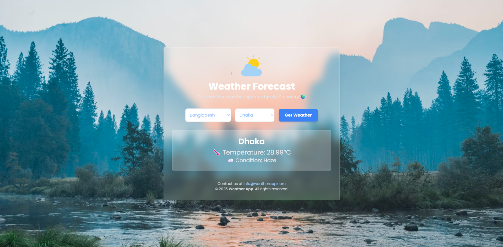

# Weather App

A web application built with Django that fetches and displays real-time weather data using the OpenWeatherMap API.

## Installation

### Prerequisites
- Python 3.x
- Django
- Virtual Environment (optional but recommended)

### Steps
1. **Clone the repository:**
    ```sh
    git clone https://github.com/yourusername/project_weather_app.git
    cd project_weather_app
    ```

2. **Create a virtual environment and activate it:**
    ```sh
    python -m venv venv
    source venv/bin/activate  # On Windows use `venv\Scripts\activate`
    ```

3. **Install the required packages:**
    ```sh
    pip install -r requirements.txt
    ```

4. **Set up the Django project:**
    ```sh
    python manage.py migrate
    ```

5. **Run the development server:**
    ```sh
    python manage.py runserver
    ```

6. **Access the application:**
    Open your web browser and go to `http://127.0.0.1:8000`


## Usage
1. Open the application in your web browser.
2. Select your country and city from the dropdown menus.
3. Click the "Get Weather" button to fetch and display the weather information.


## Technologies Used
- **Backend**: Django
- **Frontend**: Tailwind CSS, JavaScript
- **API**: OpenWeatherMap API


## Contributing
Contributions are welcome! Please follow these steps to contribute:
1. Fork the repository.
2. Create a new branch with a descriptive name.
3. Make your changes and commit them.
4. Push your changes to your forked repository.
5. Create a pull request describing your changes.


## License
This project is licensed under the MIT License. See the [LICENSE](LICENSE) file for more details.


## Contact
If you have any questions or feedback, please feel free to reach out:
- **Name**: Your Name
- **Email**: yourname@example.com



